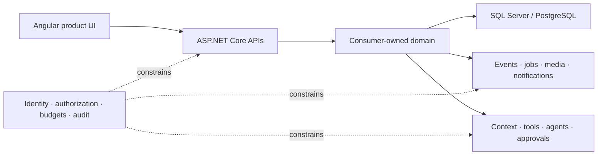
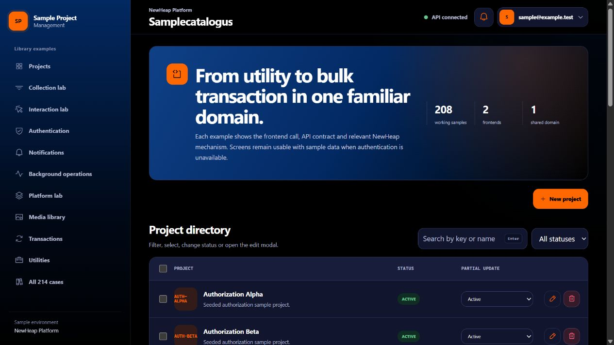
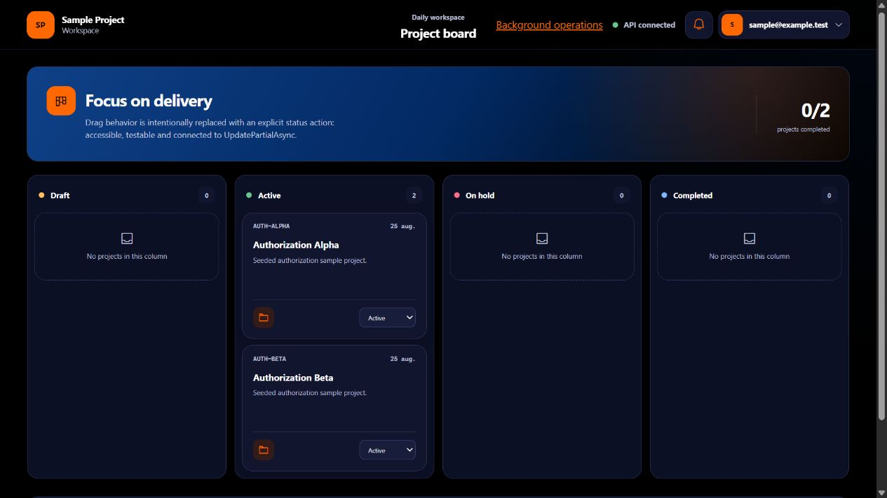
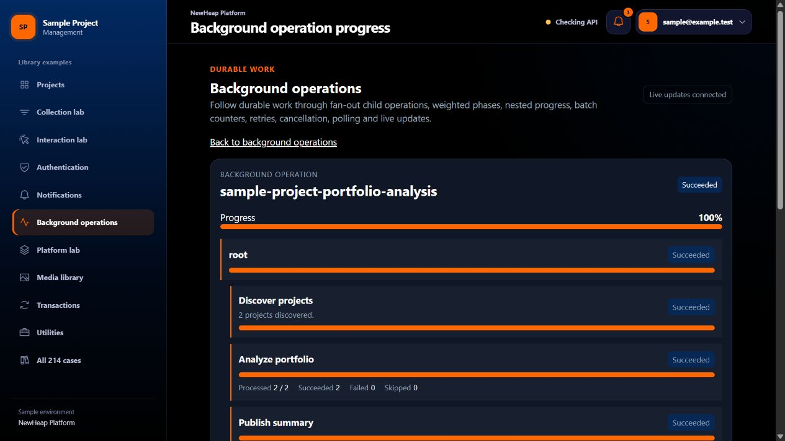

<p align="center">
  
</p>

<h1 align="center">NewHeap Platform</h1>

<p align="center">
  <strong>Build serious .NET and Angular products without rebuilding the foundation every time.</strong><br>
  Secure APIs, data access, identity, durable operations, polished product UI and governed AI—designed as one coherent platform surface.
</p>

NewHeap Platform is an opinionated set of reusable .NET 10 and Angular 20
libraries for long-lived business applications. Its goal is simple: let product
teams spend their energy on their domain while the difficult cross-cutting
behavior remains consistent, testable and operationally honest.

It is not a generated application or an all-or-nothing framework. Adopt the
capabilities you need, keep your domain model and migrations in your own
application, and follow executable examples that prove the preferred path.

## What can you build?

| Product outcome | NewHeap foundations |
| --- | --- |
| Secure management portals | Authentication, tenant-aware authorization, typed APIs, collections, forms, modals, localization and a responsive Angular shell |
| Data-rich business systems | Repository and query foundations, projections, filtering, sorting, paging, partial updates, mapping and explicit units of work |
| Reliable operational workflows | Transactional events, idempotent consumers, jobs, notifications and durable background operations with retries, cancellation, suspension and live progress |
| Media-centric products | Authorized folders and files, metadata, thumbnails, HTTP contracts, filesystem or S3-compatible storage and media events |
| Governed AI experiences | Named model profiles, generated tools, authorized context, retrieval and ingestion, budgets, approvals, MCP interoperability, Agent Framework adapters and evaluation seams |
| Maintainable platform families | Shared conventions, provider-specific implementations, reusable test helpers, public API snapshots and versioned guidance for humans and coding agents |



## A lot of batteries. No hidden ownership.

- **Backend foundations** — controller contracts, ProblemDetails, Scalar and
  OpenAPI metadata, provider-neutral repositories, projections, mapping,
  configuration, logging and health behavior.
- **SQL Server and PostgreSQL** — explicit provider packages and real relational
  evidence where database semantics matter.
- **Angular product building blocks** — API services, fluent server-driven
  collections, lifecycle-safe pages, accessible modals, dropdowns,
  notifications, background progress and light/dark product shells.
- **Operations that survive a request** — transactional outbox patterns,
  idempotency, leases, retries, fan-out work, checkpoints and resumable approval
  waits.
- **AI that does not become a security boundary** — provider-neutral model
  clients, data classification, scoped context, bounded inputs, capability
  discovery, canonical approvals, cost/call budgets and content-free telemetry
  defaults.
- **Executable guidance** — the reference application, consumer guide, atomic
  rules and distributable development skill are generated from one validated
  case catalog.

## See it running

`SampleProjectManagement` is executable documentation rather than a collection
of disconnected snippets. It runs a real API, PostgreSQL, RabbitMQ and two
Angular applications through Aspire.



<table>
  <tr>
    <td width="50%"></td>
    <td width="50%"></td>
  </tr>
  <tr>
    <td align="center"><sub>A focused day-to-day workspace built from the same shared contracts.</sub></td>
    <td align="center"><sub>Durable, nested work with live progress, retries and idempotent execution.</sub></td>
  </tr>
</table>

Explore the [executable sample](examples/SampleProjectManagement/README.md), its
[interactive case catalog](examples/SampleProjectManagement/docs/sample-catalog.md)
or the [NewHeap consumer guide](docs/consumer-guide/index.md).

## The NewHeap philosophy

1. **Expected outcomes are explicit.** Validation, authorization, conflict,
   concurrency and recoverable workflow outcomes use `TaskResult` or
   `TaskResult<T>`. Callers should not need exceptions for normal control flow.
2. **Exceptions stay exceptional.** Cancellation, invalid programmer
   configuration, corrupt state, lost ownership guarantees and unexpected
   infrastructure failures remain diagnosable exceptions.
3. **Policy decides; context informs.** UI state and AI prompts are never an
   authorization boundary. Resource access, tenant scope, capabilities,
   approvals and budgets are enforced by trusted code.
4. **Consumers own their domain.** NewHeap owns reusable behavior; applications
   own their entities, permissions, workflows, migrations and business rules.
5. **Samples are part of the contract.** A public capability is not complete
   until the sample demonstrates it, focused tests verify it and consumer
   guidance explains the preferred usage.
6. **Operational truth beats happy-path magic.** Durable state, idempotency,
   auditability, safe failure codes and observable progress are designed in
   from the start.

The complete maintenance contract lives in
[AGENTS.md](AGENTS.md#library-design-philosophy).

## Start exploring

Install .NET 10, Node.js 22 or later, npm and Docker. Follow the
[sample setup](examples/SampleProjectManagement/README.md#run-the-sample) to run
the complete Aspire environment.

Run the backend verification from the repository root:

```text
dotnet test src/Back-end/NewHeap.Platform.sln
dotnet test examples/SampleProjectManagement/src/Back-end/SampleProjectManagement.slnx
```

The main implementation areas are:

- `src/Back-end/Libraries` — reusable .NET libraries and test-support packages;
- `src/Front-end/projects` — reusable Angular packages;
- `examples/SampleProjectManagement` — executable backend and frontend evidence;
- `guidance` and `docs/consumer-guide` — validated consumer rules;
- `skills` and `plugins/newheap-platform` — versioned development guidance;
- `release/manifest.json` — package groups and protected release definitions.

## Built for human and AI-assisted development

NewHeap ships the same development contract to maintainers and coding agents.
The consumer skill routes foundation, backend, frontend, authentication,
database, media, background-processing, runtime-configuration and testing work
to focused instructions backed by executable sample cases.

To pin the supported workflow into a consumer repository for Codex:

```text
node tools/guidance/install-consumer-skills.mjs --consumer <consumer-root>
```

Use `--target claude` or `--target both` for the corresponding managed skill
directory. See the [skill manifest](skills/skill-manifest.json) for the complete
suite.

## Releases, contributing and support

Package groups are defined in [release/manifest.json](release/manifest.json).
Reviewed SemVer changes, package creation, anonymous verification and
checksummed release artifacts belong to the protected release workflow; packages
are not published directly from maintainer workstations. See the
[release guide](docs/how-to/release-newheap-libraries.md).

Read [CONTRIBUTING.md](CONTRIBUTING.md) before proposing a change. Community
support is described in [SUPPORT.md](SUPPORT.md); use [SECURITY.md](SECURITY.md)
for private vulnerability reporting.

Unless otherwise noted, NewHeap-authored software is licensed under the
[Apache License 2.0](LICENSE). See [NOTICE](NOTICE),
[THIRD-PARTY-NOTICES.md](THIRD-PARTY-NOTICES.md) and
[TRADEMARKS.md](TRADEMARKS.md).
