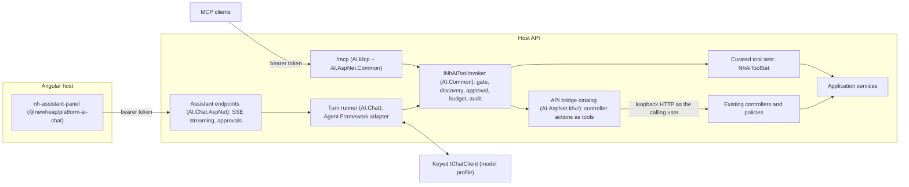

# AI Assistant and API Bridge Plan

This document records the architecture and implementation plan for an in-app
AI assistant and an API bridge that exposes existing controller actions as
governed NewHeap AI tools. It is a plan, not usage documentation: once the
packages exist, their READMEs, the consumer guide and the sample cases listed
below are authoritative.

## Goals

- Let users of a NewHeap-based application work through an AI chat with agents,
  where every action runs strictly within the roles and permissions of the
  signed-in user.
- Publish the same actions as MCP tools without a second authorization model.
- Keep everything generic in reusable packages, so an application enables the
  assistant with one registration, one permission and one configuration flag.

## Architecture

Two tool layers share one governance pipeline:

- **Bridge tools** (breadth): every eligible MVC action becomes a tool at
  startup. The tool executes through the host's real HTTP pipeline with the
  caller's own bearer token, so controller policies, model validation, tenant
  or division filters and logging apply exactly as they do for the UI.
- **Curated tools** (depth): a small number of source-generated
  `[NhAiToolSet]` classes for composite workflows that a model should not
  assemble from several raw API calls. They follow the existing local-tool
  rules: services instead of controllers, approvals, verifiers and idempotency.

Both layers run through `INhAiToolInvoker`, so gate, discovery, capability,
approval, budget and audit behavior are identical.

### Turn sequence

1. The Angular panel posts the user message with the existing bearer token.
2. The turn runner resolves an `NhAiInvocationContext` from the authenticated
   request (actor, purpose `assistant`, scopes, capability grants).
3. Discovery returns only the tools this user may see, intersected with the
   selected agent's allow-list.
4. The model selects a tool; the invoker re-checks the gate, reserves budget
   and evaluates the effect.
5. Read-only calls execute directly. Mutations create an exact proposal and
   pause the turn in `waiting-for-approval`; the user approves or rejects in
   the panel, and the turn resumes with a bound approval.
6. Bridge failures such as 400, 401, 403 and 404 become structured
   `TaskResult` failures with stable codes, never protocol errors.
7. Text deltas and tool status stream to the panel as server-sent events.

## Packages

### `NewHeap.Platform.AI.AspNet.Mvc` (API bridge)

- Discovers actions through `IApiDescriptionGroupCollectionProvider`: verb,
  route template, route/query/body parameters and authorization policies.
- Excludes anonymous actions, non-actions, file uploads, actions without an
  explicit policy, DELETE actions and excluded controllers by default.
- Synthesizes input schemas with `JsonSchemaExporter`; a conventions type maps
  flat tool input to route values, query string and body, and serializes the
  body with the host's MVC JSON settings.
- Maps effects from HTTP verbs (GET read-only, PUT/PATCH idempotent mutation,
  POST mutation, DELETE destructive and opt-in only); every non-read tool
  requires approval through the standard effect policy.
- Filters discovery per user with `IAuthorizationService` so a user never sees
  a tool whose policy would fail.
- Publishes an attested runtime catalog so bridge tools can enter the MCP
  export path.

### `NewHeap.Platform.AI.Chat`, `.SqlServer`, `.PostgreSql`

- Library-owned schema `nhai` with provider-specific migrations, following the
  media file-structure storage pattern, so consumers do not change their own
  `DbContext`.
- Entities: conversations, messages, tool invocations, approvals, a durable
  budget ledger and durable idempotency leases.
- Turn runner on the Agent Framework adapter, agent registry with versioned
  prompt assets and tool selectors, per-user daily budgets, per-turn tool-call
  limits, deadlines and a configuration kill switch.
- Content-free audit through `INhAiAuditSink` plus a consumer business-audit
  hook that receives identifiers and result codes only.

### `NewHeap.Platform.AI.Chat.AspNet`

- Minimal API endpoints under a configurable prefix (default `/api/assistant`)
  for status, agents, conversations, messages (SSE), approval decisions and
  cancellation, protected by a configurable access policy and same-owner
  checks.

### `@newheap/platform-ai-chat`

- Standalone Angular 20 components (launcher, panel, conversation list, thread,
  composer, tool-call card, approval card, agent picker) with signals and
  `OnPush`.
- `fetch`-based SSE client, because `EventSource` cannot send an
  `Authorization` header.
- `provideNhAssistant(...)` configuration with host-supplied token access and
  access policy; `en` and `nl` translation bundles; CSS variables for light and
  dark themes; no ng-bootstrap dependency.
- A mock API entry point so the panel can be demonstrated without a back end.

### Changes to existing packages

| Package | Change | Reason |
| --- | --- | --- |
| `NewHeap.Platform.AI.Common` | `INhAiAttestedToolCatalog` and startup attestation that every function is a governed `SharedInvoker` function bound to one of the catalog descriptors and that the manifest hash matches. | Admit runtime catalogs without weakening the generated-catalog export rule. |
| `NewHeap.Platform.AI.Mcp`, `NewHeap.Platform.AI.AspNet.Common` | The export path accepts generated and attested catalogs. | Bridge tools over `/mcp`. |
| `NewHeap.Platform.AI.AspNet.Common` | `INhAiCallerCredentialAccessor` for same-user delegated calls. | The bridge can forward the request bearer token while the invocation context never contains it. |

## Guidance positions

- The existing local-tool guidance advises against calling controllers from a
  tool. The API bridge deliberately departs from that guidance as a separate,
  documented catalog kind whose authorization boundary is the controller
  itself. Curated tools continue to follow the local-tool rule. The new rule
  `nh-ai-api-bridge` records when each layer is preferred.
- The MCP guidance admits only source-generated catalogs to the export path.
  Attested runtime catalogs extend that rule without relaxing its governance
  requirement.

## Authorization model

1. Identity comes only from the authenticated `ClaimsPrincipal`; the invocation
   context holds opaque identifiers, never tokens or raw claims.
2. Bridge tools rely on controller authorization at execution time and use the
   same policies to filter discovery.
3. Curated tools declare required capabilities; capabilities are granted only
   after the mapped policy succeeds, and scope values come from the context,
   never from model input.
4. Every mutation requires a user approval bound to the proposal hash, actor
   and expiry; an agent can never approve its own proposal.
5. Model input, tool results and retrieved documents are untrusted data.

## Delivery lanes and sample cases

The work is delivered in parallel lanes that each own separate packages and
sample files. The following SampleProjectManagement cases are reserved:

| Case | Title |
| --- | --- |
| SPM-242 | API bridge catalog over MVC controllers |
| SPM-243 | API bridge tools over MCP with attested catalog |
| SPM-244 | Attested catalog validation rejects ungoverned functions |
| SPM-245 | Assistant conversation with streamed turn |
| SPM-246 | Assistant mutation paused for approval and resumed |
| SPM-247 | Durable assistant budget and idempotency ledgers |
| SPM-248 | Assistant panel in the management portal |
| SPM-249 | End-to-end assistant over bridge and curated tools |

Each case stays `planned` until its executable evidence, focused tests, rule
and release notes exist. External MCP authorization (OAuth for personal MCP
clients), background turns and multi-agent workflows are out of scope for this
plan.
