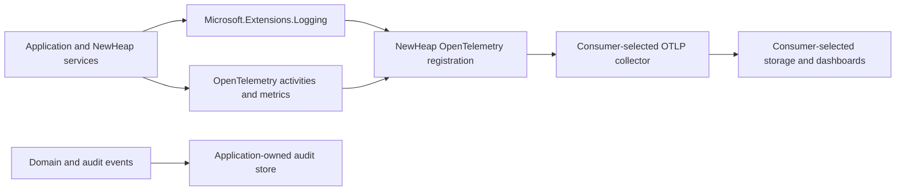

# Logging, Observability, and Sentry Removal Plan

Status: implemented; release publication pending
Scope: NewHeap backend libraries, Angular library, executable sample, consumer guidance, and known consumers
Release impact: breaking/major

## Execution status

Implemented on 2026-08-25:

- NewHeap now provides the provider-neutral logging and OpenTelemetry composition described in this plan;
- backend and Angular Sentry dependencies, configuration, services, and sample usage have been removed;
- operational services and adapters have been audited for structured, safe failure logging;
- correlation, observability composition, and browser error forwarding have regression tests;
- the executable sample, generated guidance, pinned consumer skills, public API snapshots, release metadata, and migration documentation have been updated;
- release artifacts have been prepared and dry-run validated, but have not been published to external registries.

Companist Base and CompanistOS retain their current package versions until the prepared NewHeap major versions are published. Their pinned skills and migration runbooks are already updated, so the package, ServiceDefaults, bootstrap, and lockfile migration can be performed atomically after registry availability.

## Objective

Make NewHeap the single provider-neutral integration point for application logging and OpenTelemetry. All operational NewHeap services, hosted workers, middleware, and external I/O adapters must emit safe, structured diagnostics through `Microsoft.Extensions.Logging`. Remove Sentry completely from the backend and frontend library surfaces.

The resulting libraries must:

- configure logs, metrics, and traces exactly once;
- support ASP.NET applications and non-HTTP workers;
- use standard OpenTelemetry configuration and resource conventions;
- preserve consumer ownership of collectors, storage, retention, dashboards, and deployment-specific attributes;
- keep technical logging separate from domain and audit history;
- never expose secrets, stack traces, or raw exception text through public results;
- provide executable sample evidence and regression coverage for the preferred integration.

## Non-goals

- NewHeap will not ship Loki, Prometheus, Grafana, Alloy, or another collector/storage stack.
- NewHeap will not hard-code tenant, workspace, company, environment, or other consumer-specific identifiers.
- NewHeap will not turn every validation, mapping, or query helper into a logging source.
- Removing Sentry does not automatically introduce a different vendor-specific browser telemetry SDK.
- Database audit logging is not replaced by OpenTelemetry and is not an `ILogger` provider.

## Current baseline

A repository-wide inventory found:

- 279 backend library C# files;
- 54 service-like files by naming convention, of which 22 currently use `ILogger` and 32 do not;
- 28 files containing catch blocks, of which 16 contain no logging;
- no direct `Console.Write*` calls in backend library code;
- no interpolated `ILogger` templates in backend library code;
- silent catches, public `TaskResult` values containing `Exception.ToString()`, repeated exception-message properties, and missing central OpenTelemetry behavior tests;
- overlapping OpenTelemetry registrations between NewHeap and consumer-owned ServiceDefaults projects;
- public Sentry APIs and dependencies in both backend and Angular packages;
- executable sample cases that currently teach Sentry-specific behavior.

The service-file count is an audit aid, not a requirement to inject a logger into every class. Logging is required at operational boundaries, not in pure computation.

## Target architecture



NewHeap owns SDK registration, instrumentation, correlation, structured scopes, safe defaults, and extension points. The host owns the endpoint, credentials, collector, storage, retention, dashboards, and static deployment metadata.

## Logging contract

### Levels

| Level | Intended use |
| --- | --- |
| `Trace` | Very detailed internal diagnostics that are normally disabled. |
| `Debug` | Expected skips, rejections, retry details, and internal decisions. |
| `Information` | Host or worker lifecycle and meaningful completed operations. |
| `Warning` | Unexpected but recoverable behavior or degraded operation. |
| `Error` | An operation failed and the current boundary handles, translates, or suppresses the exception. |
| `Critical` | The host cannot safely continue or data integrity may be compromised. |

### Rules

- Use static message templates with named properties.
- Log an exception once, at the boundary that handles or translates it.
- Do not log and immediately rethrow unless the log adds unique boundary context and duplicate reporting is prevented.
- Do not log normal validation, not-found, or authorization outcomes as errors.
- Never log access tokens, refresh tokens, cookies, authorization headers, passwords, private keys, mail bodies, complete request/response bodies, or connection strings.
- Avoid user identifiers, paths, and other unbounded values as metric attributes.
- Use stable event names and event IDs per package.
- Use source-generated `[LoggerMessage]` methods for repeated and high-volume paths.
- Preserve cancellation: an expected caller cancellation is not an error.
- Do not return `Exception.ToString()` or stack traces in `TaskResult`, HTTP responses, or other public contracts.

## Workstream 1: define the public observability surface

1. Add a provider-neutral observability options type in `NewHeap.Platform.Common`.
2. Add a host-level registration that supports workers and console/daemon hosts.
3. Add an ASP.NET registration in `NewHeap.Platform.AspNet.Common` that composes the common registration and adds ASP.NET instrumentation.
4. Make registration idempotent when multiple NewHeap composition entry points are used.
5. Keep existing configuration entry points working during migration, but route them through the single registration implementation.
6. Deprecate the incorrectly named `UseOtlpUseExporter` API and map it to the new exporter configuration while it remains available.
7. Record every intentional public API change in the public API snapshot and migration notes.

Recommended default behavior:

- enable structured OpenTelemetry logging with formatted messages, scopes, and parsed state values;
- add runtime metrics and HttpClient metrics/tracing in Common;
- add ASP.NET Core metrics/tracing in AspNet Common;
- enable OTLP export automatically when `OTEL_EXPORTER_OTLP_ENDPOINT` is present;
- read protocol, headers, service name, and resource attributes from standard `OTEL_*` configuration;
- use the host application name as the fallback `service.name`;
- provide an explicit disable mode for tests and intentionally local-only hosts;
- provide callbacks for additional logging, metrics, tracing, and resource configuration without exposing a collector vendor.

## Workstream 2: remove Sentry completely

This is an intentional breaking change and requires a major release.

### Backend removal

- Remove the `Sentry`, `Sentry.AspNetCore`, and `Sentry.Extensions.Logging` package versions and references.
- Remove `NewHeapPlatformCommonConfigurator.WithSentry`.
- Remove `NhSentryExtensions`, `UseNewHeapSentry`, and their public exports.
- Remove direct Sentry SDK access from trace/correlation middleware.
- Replace Sentry scope tags with `ILogger.BeginScope` and OpenTelemetry activity tags.
- Remove Sentry-specific options, comments, tests, sample code, and generated public API entries.

### Angular removal

- Remove `@sentry/angular`, `@sentry/browser`, and `@sentry/core` from library and sample dependencies.
- Remove all `NhSentry*` configuration types, services, trace adapters, error handlers, hooks, injection tokens, module providers, and public exports.
- Regenerate package lock files after dependency removal.
- Preserve a provider-neutral Angular `ErrorHandler` integration and the existing multi-handler extension seam where it remains useful.
- Do not send browser telemetry directly to an OTLP collector by default. A future browser telemetry implementation must have an explicit security, authentication, CORS, sampling, and data-redaction design.

### Sample and guidance replacement

- Update `SPM-105` from `logger/Sentry/stopwatch` to provider-neutral logging and OpenTelemetry evidence.
- Replace the behavior represented by `SPM-159 Frontend Sentry` with an executable provider-neutral frontend error-handling case rather than deleting the case without replacement.
- Remove Sentry from generated catalogs, consumer guidance, skills, and package compatibility metadata.
- Keep Sentry references only in migration documentation and release notes where necessary.

## Workstream 3: correlation and enrichment

1. Use W3C trace and span identifiers as the primary distributed correlation mechanism.
2. Continue supporting `X-Correlation-ID` as an optional external identifier.
3. Validate external correlation identifiers with a bounded length and safe character set before placing them in log state or response headers.
4. Emit one canonical `correlation_id` scope property.
5. Include `service.name`, `service.version`, and `deployment.environment.name` as standard resource attributes.
6. Allow consumers to add static resource attributes and bounded request/activity scope values through provider-neutral callbacks.
7. Do not place per-request user, route, document, or workspace identifiers into metric labels automatically.

## Workstream 4: audit NewHeap runtime code

Review every registered service, handler, hosted service, middleware, event adapter, and storage provider. Classify each type as:

- operational boundary: logger required;
- high-volume internal operation: activity/metric preferred, logger only for abnormal behavior;
- pure computation or validation: no logger required;
- domain/audit behavior: use the audit contract, not technical logging.

### Common

- Add safe diagnostics to mail delivery and external authentication operations.
- Use `IHttpClientFactory` for external HTTP services where applicable.
- Normalize existing API-client logging, cancellation behavior, response-body bounds, and redaction.
- Replace silent resolver failures in `LogHelperService` with safe debug diagnostics or an explicitly tested no-log policy.
- Review `NhLoggerExtensions` and stop representing expected business failures as synthetic exceptions in the preferred API.
- Keep compatibility overloads temporarily when required, mark them obsolete, and document the replacement.

### ASP.NET Common

- Make exception handling the central HTTP failure boundary.
- Add technical diagnostics to authentication handlers without logging credentials or enabling user enumeration.
- Treat normal failed authentication and authorization as expected control flow.
- Give impersonation a clear audit boundary that remains separate from technical logs.
- Normalize notification service event IDs, levels, scopes, retries, and lifecycle messages.
- Remove duplicate exception-message properties when the exception is already attached.
- Add logging to database-audit file/translation failures without duplicating every audit entry into technical logging.
- Review middleware, binders, partial-update executors, and controller helpers that currently catch or translate exceptions.

### Events and CAP

- Review event publication, transaction, and consumer-selection boundaries.
- Avoid duplicating errors already owned by the CAP transport layer.
- Add activities with bounded event type/topic metadata, never complete event payloads.
- Add stable diagnostics for invalid lifecycle transitions and missing configuration.

### Media

- Replace raw exception text returned by S3 and media services with stable safe failure codes.
- Log storage failures internally with operation, provider, and opaque resource identifiers.
- Add diagnostics for cleanup/rollback failures and event-handler failures.
- Align filesystem, SQL Server, PostgreSQL, and S3 operation names and levels.
- Keep expected unauthorized and not-found results out of warning/error logs.
- Remove or explicitly document and test every silent catch.

### Constructor compatibility

Adding `ILogger<T>` must not accidentally break manual construction in a release that otherwise preserves a type. Retain an existing constructor with a compatibility path, add a DI-preferred constructor where safe, or defer the change to the major release already required by Sentry removal. Verify constructor selection through DI tests.

## Workstream 5: frontend error handling after Sentry

1. Keep Angular's global error handling provider-neutral.
2. Retain an extension point for consumer-owned handlers.
3. Normalize browser errors into a safe diagnostic model before handing them to an optional consumer handler.
4. Do not render stack traces or raw proxy responses to users.
5. Ensure unhandled errors remain visible in development and test environments.
6. Add tests for multiple handler execution, handler failure isolation, teardown, and disabled remote handling.

Remote browser telemetry is a separate future decision. It must not be introduced as an incidental replacement for Sentry.

## Workstream 6: executable sample evidence

Extend SampleProjectManagement rather than adding documentation-only examples.

- Replace its duplicate OpenTelemetry registration with the preferred NewHeap integration while retaining sample-owned health checks, service discovery, and resilience where applicable.
- Add a concrete sample service that emits structured logs from a service rather than only from a controller.
- Demonstrate scopes, correlation, trace/span context, success, expected failure, and handled exception behavior.
- Capture logs and telemetry with in-memory test exporters.
- Demonstrate that secret-like values and raw exception text are absent.
- Add provider-neutral Angular error-handler evidence replacing the Sentry playground behavior.
- Update the canonical case registry first, then regenerate derived plans, status, catalogs, and `sample-cases.ts`.

The sample subtree currently refers to a missing `skills/sample-project-management-development/SKILL.md`. Restore or correct that repository instruction before treating sample implementation work as complete.

## Workstream 7: tests and static guardrails

Add focused regression tests under the non-packable plural test projects.

### Runtime behavior tests

- logging provider registration occurs exactly once;
- common and ASP.NET instrumentation compose without duplicate exporters;
- standard `OTEL_*` configuration is honored;
- exporter disable mode works;
- service name and resource attributes are correct;
- structured state, scopes, correlation ID, trace ID, and span ID are present;
- invalid external correlation IDs are rejected or replaced;
- cancellation is not logged as an error;
- S3/media failures return safe results and retain internal exception diagnostics;
- no secret values enter captured logs;
- Angular error handlers execute safely without Sentry.

### Static policy checks

- disallow `Console.Write*` in reusable library code;
- enable `CA2017` and `CA2254` as errors;
- disallow interpolated logging templates;
- disallow `Exception.ToString()` in public result/response construction;
- flag empty broad catches unless present in a reviewed allowlist with a rationale;
- require an `ILogger<T>` for every NewHeap-owned hosted service;
- verify no Sentry packages, imports, public declarations, or runtime references remain;
- verify package dependency trees no longer contain Sentry.

Use source-generated logging for high-volume code without requiring it for every one-off diagnostic.

## Workstream 8: consumer migration

For each known consumer:

1. Upgrade backend and Angular NewHeap packages together.
2. Remove duplicate OpenTelemetry package references and registration from consumer ServiceDefaults.
3. Keep consumer-owned health checks, service discovery, resilience, collector resources, dashboards, and storage.
4. Configure standard `OTEL_*` environment variables in the deployment layer.
5. Connect every process, including APIs, background workers, and host agents.
6. Remove Sentry npm packages, providers, configuration, environment variables, and initialization code.
7. Remove unused database-log configuration or explicitly register the audit feature that owns it.
8. Verify that consumer-specific resource attributes remain bounded and deployment-owned.

Trace storage is not required to complete the logging migration. A consumer that does not yet store traces must either document that gap or disable trace export deliberately until a backend is selected.

## Workstream 9: guidance and release

- Add or update an atomic operations rule for NewHeap logging and observability.
- Update the canonical sample registry and evidence paths.
- Update migration documentation for removed Sentry APIs and the new observability entry points.
- Refresh the public API snapshot for intentional .NET and Angular surface changes.
- Increment the guidance and plugin versions together.
- Regenerate consumer guides, focused skills, the plugin mirror, sample plans/status, and `sample-cases.ts`.
- Treat the release as a major version because Sentry APIs and Angular exports are removed.
- Dry-run the affected NuGet, npm, guidance, and plugin release units before publication.

## Verification matrix

No database schema or provider-specific query behavior is planned. SQL Server/PostgreSQL execution is therefore not a feature matrix requirement unless implementation work unexpectedly changes database behavior.

Run at minimum:

```text
dotnet test src/Back-end/NewHeap.Platform.sln
dotnet test examples/SampleProjectManagement/src/Back-end/SampleProjectManagement.slnx
npm run guidance:generate
npm run guidance:snapshot
npm run guidance:validate
npm run skills:eval
npm run plugin:validate
npm run release:test
npm run sample:structure
cd examples/SampleProjectManagement/src/Front-end
npm run generate:samples
npm run verify:samples
npm run build:management
npm run build:workspace
```

Also build and test the reusable Angular workspace after removing Sentry dependencies, and inspect generated package dependency trees before release.

## Definition of done

- NewHeap owns one idempotent logging, metrics, and tracing registration path.
- ASP.NET applications and non-HTTP workers use the same common observability foundation.
- Every operational boundary either emits safe structured diagnostics or has a documented and tested reason not to log.
- No exception stack trace or secret reaches a public result or normal log state.
- Technical logs and domain/audit history remain separate.
- No Sentry NuGet or npm dependency remains in NewHeap packages, samples, lock files, or known consumers.
- No Sentry runtime code, configuration, injection token, provider, public export, or generated API declaration remains.
- Sentry is mentioned only in migration documentation and release notes.
- `SPM-105` proves provider-neutral backend observability.
- `SPM-159` proves provider-neutral frontend error handling.
- Focused behavior tests and static policy checks pass.
- Generated guidance, sample artifacts, public API snapshots, and plugin contents are clean after regeneration.
- Known consumers build and demonstrate logs flowing through their selected OTLP collectors.
- Release notes clearly identify the breaking removals and migration path.

## Recommended execution order

1. Freeze the public contract, logging rules, event naming, and compatibility decisions.
2. Remove Sentry from backend and Angular code and replace required extension seams.
3. Centralize the OpenTelemetry registration and correlation pipeline.
4. Audit and migrate NewHeap runtime services package by package.
5. Add focused backend and frontend tests plus static policy checks.
6. Update SampleProjectManagement executable evidence.
7. Update canonical guidance, regenerate derived artifacts, and refresh API snapshots.
8. Migrate known consumers and remove duplicate registrations and Sentry dependencies.
9. Run the full verification matrix and prepare the major release.
