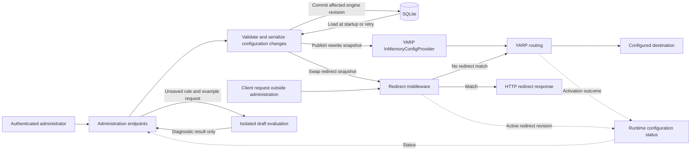

# NewHeap Proxy Library Design

Status: literal SQLite redirects, MVC administration, authentication, login auditing and save/activation implemented; managed rewrites and full-pipeline draft testing pending

Date: 2026-09-07  
Scope: an ASP.NET Core proxy and redirect library with embedded administration, draft rule testing, and SQLite persistence

## Project foundation and contract stage

The backend solution now contains the .NET 10 project scaffolds
`NewHeap.Platform.AspNet.Proxy` (Razor SDK with MVC support),
`NewHeap.Platform.AspNet.Proxy.Sqlite`, and a corresponding non-packable
`*.Tests` project for each library. The SQLite project references the neutral
proxy project. Public data/service contracts and explicit `NotImplementedException`
stubs exist for future features. `AddNewHeapProxy` registers SQLite redirect storage,
validation, runtime, and startup loading alongside empty native YARP configuration.
`UseNewHeapProxy` installs literal redirect middleware and calls `MapNewHeapProxy`
internally. Microsoft.Data.Sqlite owns storage in the SQLite project; no consumer
DAL migrations are used. MVC management, login auditing and single-rule local
draft previews are implemented. Managed rewrite persistence/activation and the
full-pipeline draft API remain unimplemented.

See the [project README](../../src/Back-end/Libraries/NewHeap.Platform.AspNet.Proxy/README.md)
for the contract map and verification commands. Library tests cover host startup,
request continuation, native route creation, literal matching, real SQLite persistence,
exclusive ownership, invalid data, and restart behavior. SPM-238 demonstrates the
two-call Add/Use flow, real SQLite-backed HTTP redirects, and consumer contracts;
SPM-239 remains a runtime `library-gap`. The projects are not yet part
of a release unit, and existing release versions are unchanged.

The initial options choose configurable defaults: eight-hour sessions, five login
attempts per minute, 90-day login audit retention, cleanup batches of 1,000 events,
audit pages capped at 100, 1,000 rules per engine, and draft inputs capped at 64 KiB
with a five-second test budget. SQLite defaults to `App_Data/newheap-proxy.db` and
a five-second busy timeout. The literal rule-count limit and SQLite timeout are
enforced. Session/rate/audit settings and a 64 KiB administration form limit are
also enforced. Full draft API budgets remain future contracts. The fixed account
uses a username, ASP.NET Identity hash and optional credential version;
there are no usable default credentials.

## Administration implementation milestone

The current panel includes literal redirect CRUD, enable/disable, ordering,
search, host/method restrictions, status/query options, local single-rule draft
preview, deletion confirmation, revision conflicts and activation retry. It is a
Razor class library with compiled views and no external frontend dependencies.

The reserved MVC branch isolates administration from host fallback/YARP routes.
Every request checks the optional IP allowlist; production requires HTTPS. A
separate cookie scheme preserves host authentication defaults, scopes the session
to the administration PathBase, uses CSRF-protected POST forms, and invalidates
sessions when the configured credentials/version change. Missing credentials close
the panel without disrupting proxy traffic. Account throttling uses one bounded
fixed-window budget. Login auditing occurs before cookie issuance and fails closed;
retention deletes bounded batches on attempts rather than on a background timer.
The effective client address is recorded; an original peer replaced by host
forwarding middleware is left unavailable rather than inferred from untrusted headers.

SQLite schema 2 adds audit events and an ordered index through a transactional
upgrade from schema 1, preserving redirects. INhProxyConfigurationService commits
before publishing; publication survives HTTP cancellation, and failed activation
retains the committed revision in TaskResult.Data. The UI exposes retry without
saving a second configuration. The draft button tests only its unsaved rule with
the runtime matcher, not the full future test API or general cycle analysis.

SPM-238 provides the runnable SampleProjectManagement.Proxy host, public-service
consumer evidence and real HTTP/SQLite regression coverage. See
[administration setup](../../examples/SampleProjectManagement/docs/proxy-administration.md).
The remaining sections describe the broader target design; incomplete features
remain tracked as SPM-239 gaps.

## Objective and agreed direction

Allow a consumer to create an ASP.NET Core application, register NewHeap Proxy,
configure administration access, and run a manageable YARP reverse proxy without
building a separate administration application.

The agreed architecture is:

- Rewrite rules proxy requests through YARP using its existing
  `InMemoryConfigProvider` and expose commonly used YARP features. Version one
  supports exactly one destination per cluster; multiple destinations, load
  balancing, failover between destinations, and session affinity are deferred.
- Redirect rules return HTTP redirects through middleware, without forwarding
  the request through YARP or contacting an upstream service.
- SQLite provides persistence across restarts. Proxy requests never query SQLite.
- Startup creates or upgrades the database, loads persisted configuration, and
  initializes the provider before accepting proxy traffic.
- Administration changes are validated and persisted before being published to
  the affected engine. Rewrite and redirect systems activate independently;
  updates do not require an application restart.
- The embedded administration interface uses ASP.NET Core MVC under
  `/newheap-proxy`, one fixed administrator account, and an optional IP allowlist.
- Successful and failed login attempts are audited with their effective client
  IP address and UTC timestamp, including rejected attempts where observable.
- Redirect rules run before rewrite rules, and new redirects default to `302`.
- Administrators can test unsaved rules against example requests without saving
  them, activating them, or affecting live traffic.

These product choices are agreed. Public names and the technical mechanisms
identified at the end of this document remain to be finalized.
This document does not make any capability available or count as executable
sample evidence.

## Scope and terminology

Both rule types are required and must be explicit in storage, APIs, the rule
list, the editor, and test results:

| Behavior | Meaning | Design position |
| --- | --- | --- |
| Rewrite rule | The browser keeps its URL; the server forwards the request to a configured destination, optionally transforming it. | Implement using YARP routes, clusters, and supported transforms. |
| Redirect rule | The server returns a redirect status and `Location`; the browser requests another URL. | Implement using middleware before proxy execution. |

"Rewrite" is the product name for reverse proxy rules, not an instruction to
rewrite the incoming request and continue to a local application endpoint.
Redirect rules have no YARP cluster or fake upstream destination. A rewrite
upstream may itself return a redirect; forwarding that response does not turn
the rewrite rule into a locally managed redirect rule.

The initial deployment target is one application instance with a local,
persistent SQLite file. Multiple writers, distributed configuration propagation,
and high availability are outside the first implementation.

Other initial non-goals are certificate issuance, DNS management, automatic
listener creation, arbitrary user-authored code or transforms, a general API
gateway product, and a separate frontend deployment. Adding a rule does not
configure DNS, a listening port, or an inbound TLS certificate.

## Consumer integration

Current startup integration (managed rewrite processing remains a future milestone):

```csharp
using NewHeap.Platform.AspNet.Proxy;
using NewHeap.Platform.AspNet.Proxy.Sqlite;

var builder = WebApplication.CreateBuilder(args);

builder.Services.AddNewHeapProxy(
    builder.Configuration.GetSection("NewHeapProxy"));

var app = builder.Build();

app.UseNewHeapProxy();

app.Run();
```

The complete implementation of `AddNewHeapProxy` will register YARP, redirect evaluation, draft testing, persistence,
startup initialization, and administration services. `UseNewHeapProxy(WebApplication)`
calls `MapNewHeapProxy` internally and returns the same `WebApplication`. The mapping
calls YARP's `MapReverseProxy`, which installs the endpoint source and loads initial
configuration. Neither a separate map call nor a separate initializer is required.
Standalone `MapNewHeapProxy(IEndpointRouteBuilder)` remains a lower-level alternative.
Literal redirect middleware and the embedded MVC administration branch are
installed by `UseNewHeapProxy`. The middleware call makes its
ordering explicit; do not hide it inside an endpoint-mapping extension.

`NhProxyOptions.ConfigureYarp(yarp => { ... })` accepts a code-only
`Action<Microsoft.Extensions.DependencyInjection.IReverseProxyBuilder>` for native
YARP customization, such as `ConfigureHttpClient`. The proxy project references
`Yarp.ReverseProxy` for this public contract. Registration invokes the
callback once after NewHeap's base YARP setup; rule reloads and draft tests do not
reinvoke it. The callback is excluded from JSON and is not persisted or bound
from appsettings. The read-only `YarpConfiguration` accessor exposes the stored
callback for registration; repeated calls replace it and null arguments are rejected.
The current registration binds startup option snapshots exposed through `IOptions<T>`,
installs YARP with an empty in-memory configuration, and invokes the callback.
`AddNewHeapProxy()` supports defaults; the configuration overload binds the supplied
section and its `Sqlite` child. A hosted lifecycle service initializes storage and
publishes the validated redirect snapshot in StartingAsync, before the HTTP server
starts (including with concurrent service startup). Administration and redirect
save/activation orchestration are implemented. Option reload and managed rewrites
remain future work.
NewHeap continues to own the managed route/cluster source. Any host customization
that a future isolated draft evaluator cannot reproduce must be reported as an
unexecuted runtime customization, not silently simulated with different semantics.

The library must document and test required middleware ordering, including
forwarded headers, redirect evaluation, routing, authentication, authorization,
antiforgery, and static assets where applicable. Establish the routing boundary
explicitly where necessary; do not rely on implicit minimal-host middleware
insertion to provide the desired order. The short integration must work in a clean host and
must not replace an existing host's authentication defaults or fallback policy.

Host configuration supplies the database path, fixed administrator credentials,
optional IP allowlist, and trusted upstream proxies. Rules
are edited through administration and persisted in SQLite. Do not introduce
competing rule ownership between appsettings and SQLite in the first version.

Use ASP.NET Core MVC controllers and Razor views under `/newheap-proxy`.
Package the MVC views and static assets with the library, using a Razor Class
Library as the packaging mechanism where appropriate. Consumers do not need
Node.js, a frontend build, or a separate UI deployment. Verify MVC controller
discovery, compiled views, and assets from an installed package and published
host, not only from a project reference. Do not substitute Razor Pages or Blazor
for the agreed MVC interface.

## Ownership and dependencies

Proposed library boundaries:

| Area | Responsibility |
| --- | --- |
| `NewHeap.Platform.AspNet.Proxy` | YARP integration, redirect middleware, rule validation and draft testing, configuration publication, administration endpoints and embedded UI. |
| `NewHeap.Platform.AspNet.Proxy.Sqlite` | Configuration and login-audit storage, library-owned schema upgrades, and convenience registration for the complete SQLite-backed setup. |

The consumer should need one package reference to the SQLite composition
package. The neutral library must not depend on its SQLite implementation.
Confirm names against suite conventions before creating projects. Do not add
more packages or storage abstractions without a concrete ownership need.

SQLite is an explicit provider capability for this feature. SQL Server and
PostgreSQL implementations are not planned for version one; record those gaps
in implementation guidance and sample metadata. This does not weaken the
repository's dual-provider requirements for changes to existing shared EF or
query behavior. Keep all SQLite SQL, registration, and schema management in
the SQLite project; never modify consumer DAL migrations for proxy storage.

## Runtime architecture



Reuse `LoadFromMemory` and `InMemoryConfigProvider.Update(routes, clusters)`.
Do not implement a custom `IProxyConfigProvider` or generic configuration
provider unless an implementation spike demonstrates a missing requirement.
Publish complete immutable snapshots rather than editing collections already
held by YARP. Let YARP perform routing, forwarding, and its supported diff/reload
behavior; do not implement a second proxy engine.

Redirect evaluation reads a separate immutable in-memory snapshot. Reuse
ASP.NET Core matching and redirect facilities where they cover the agreed
semantics; an adapter for hot reload should remain small. Do not mutate a shared
`RewriteOptions` rule list while requests are using it. Capture one redirect
snapshot per request and replace the active snapshot atomically.

### Request order and rule precedence

Agreed ordering is explicit and shared by runtime and draft tests:

1. Process host-configured trusted forwarded headers and required host security.
2. Exclude the reserved administration path and its descendants from both rule
   engines. Administration follows its own authentication/IP/antiforgery pipeline.
3. Evaluate enabled redirect rules. Lower numeric priority wins; the first match
   writes the redirect response and ends processing without contacting YARP.
4. If no redirect matches, let YARP select a rewrite route using its normal
   matching and priority semantics. A rewrite does not re-enter redirect matching.
5. Continue normal host endpoint behavior if neither applies; a standalone proxy
   with no matching endpoint returns `404`.

Priorities are scoped to a rule type, not globally interleaved. A matching
redirect takes precedence over a matching rewrite regardless of their numbers;
the UI and tester must show when a redirect shadows a rewrite. For redirect
priority ties, use stable rule ID ordering and warn about potentially overlapping
matches. YARP rewrite ambiguity retains YARP's behavior and is reported during
validation/testing where detectable. Do not write a competing YARP matcher.

### Startup

1. Validate host options, administration security, and the configured storage
   location. Fail startup on invalid configuration.
2. Acquire exclusive application ownership of the store for this deployment.
   A second instance using the same file must fail clearly rather than serving
   independent, potentially stale configurations.
3. Create the database if missing and apply versioned schema upgrades before
   loading rules. Never delete a database to recover from an initialization error.
4. Load each engine's desired revision and validate its redirect rules or complete
   YARP route/cluster snapshot, respectively.
5. Initialize YARP and the redirect snapshot and establish their active revisions
   before proxy readiness.
6. Expose administration and proxy endpoints. An intentionally empty new
   configuration is valid; unmatched proxy requests return `404`.

An unreadable, corrupt, incompatible, or invalid existing store must fail startup
with operational diagnostics. Do not silently substitute an empty configuration.
There is no persisted runtime guarantee that a revision remains active across a
restart: each process must initialize and confirm its own active state.

### Create, update, enable, disable, and delete

1. Authenticate and authorize the administrator; apply the IP policy and CSRF
   protection before accepting a mutation.
2. Enter a bounded, process-local mutation gate for the affected engine. Load its
   latest desired revision and compare it with the revision submitted by the editor.
3. Apply the requested change to a new snapshot of that engine. Validate inputs,
   references, reserved paths, and rule conflicts. For rewrites, prevalidate
   routes and clusters with YARP's `IConfigValidator`; for redirects, validate
   matching and target construction without requiring a YARP reload. Reuse the
   draft test's compilation/validation path; a successful test never skips validation.
4. Commit that engine's complete desired snapshot and incremented revision in one
   SQLite transaction, using a revision condition to reject stale writes. Leave
   the other engine's record and revision unchanged.
5. Publish only the affected engine: update the YARP provider for rewrites or swap
   the redirect snapshot for redirects. Order publication and explicit retries
   through that engine's gate so an older snapshot cannot overwrite a newer one.
   Never hold a database transaction while waiting for runtime activation.
6. Return an explicit saved/activation outcome and refresh administration status.

Once a transaction has committed, publication must not depend on the editor
keeping its HTTP connection open. A retry after a lost response must not create
a duplicate rule: use stable rule identifiers and expected revision checks.
Each gate applies only to its engine's configuration writes, never to proxy requests
or to activation in the other engine. SQLite still serializes database writers;
keep transactions short so this storage constraint does not become an activation
dependency. If used
in code, document its single-instance ceiling and distributed upgrade path with
the repository's `ponytail:` convention.

### Desired and active configuration

Each engine has its own persisted desired revision and observed active revision.
An engine is up to date when its active revision matches its own desired revision;
rewrite and redirect revision numbers need not match each other. A combined
status can summarize both engines, but must not introduce a shared activation
barrier or label an unrelated successful change as failed.

Independent activation is an agreed requirement. A redirect update can succeed
while a YARP reload is pending or rejected, and a rewrite update does not reload
redirect rules. Neither engine waits for or rolls back the other. Retain each
engine's last valid snapshot on its own failure. Use separate create/edit flows
for each rule type; do not offer an implicit atomic conversion between types.
Persistence and activation remain separate operations within each engine.

YARP may reject a reload and retain its last valid configuration. Calling
`Update` alone is not evidence of successful activation. An initial spike must
establish a supported, testable way to observe configuration application and
associate it with the published revision. Do not infer success from a timer or
from `GetConfig()` returning the desired snapshot. If confirmation is not
available, report activation as unconfirmed, never as active.

| Outcome | Persistence | Traffic and administration behavior |
| --- | --- | --- |
| Validation failure | Unchanged | Current configuration stays active; show field or configuration errors. |
| Stale editor revision | Unchanged | Return a conflict and require reloading the editor. |
| Persistence failure | Unchanged transaction | Do not publish; report that saving failed. |
| Commit followed by successful activation | New desired revision for the affected engine | New requests use that engine's new configuration; the other engine is unchanged. |
| Commit followed by rejected or unconfirmed activation | New desired revision for the affected engine | Preserve that engine's last valid snapshot on failure; show its saved and activation outcomes independently. |
| Crash after commit and before publication | New desired revision for the affected engine | Next startup loads and validates each engine's committed revision. |

Offer an authenticated retry of an engine's latest persisted revision without
creating a new revision or republishing the other engine. Do not silently roll
the database back or automatically restore
an older revision over later edits. Existing in-flight requests may complete
using the old configuration; deleting a rule is not immediate revocation of
already established connections.

## Persistent data and rule model

Prefer two desired-configuration records in one table, keyed by engine type.
Each contains its own revision, document format version, and versioned JSON.
The rewrite record owns rewrite rules, clusters, and their single destinations;
the redirect record owns redirect rules. A mutation replaces one complete record
transactionally without rewriting or incrementing the other. This supports
independent activation without adding a distributed coordination mechanism.
Login audit events use a separate append-only table; they are not rule changes
and never increment configuration revisions or notify either rule engine.
The fixed administrator is configured by the host; there is no account registry
or user-management schema in version one.
Keep the storage format owned by NewHeap instead of relying on incidental
serialization of YARP runtime objects. Do not add configuration history,
event sourcing, or a generic repository framework for this feature.

Both types have a stable identifier, explicit type, display name, enabled state,
match conditions, and priority. Their action settings are distinct and validated
by type. Redirect rules cannot carry cluster settings, and rewrite rules cannot
carry a local redirect status. Reject unknown or unsupported fields rather than
silently dropping them.

Validate missing or multiple destinations per cluster, duplicate identifiers, malformed patterns,
unsupported schemes, ambiguous equal-priority matches that can be identified,
and direct self-proxying. Define matching precedence and unmatched behavior.
Report broader overlap risks without claiming to detect every possible pattern
intersection or cross-service loop. Define practical bounds for rule count and
input sizes so validation and snapshot construction remain bounded.

SQLite requirements:

- Store the file outside the webroot on writable, durable local storage; resolve
  its path consistently and document container volume and filesystem permissions.
- Use transactions, bounded busy handling, and parameterized SQL or the selected
  SQLite library's equivalent. WAL is suitable for local concurrent reads and
  writes, but it does not enable multiple simultaneous writers or network storage.
- Provide schema versions and nondestructive upgrade tests. If using EF Core,
  use generated migrations from the start rather than mixing `EnsureCreated`
  with migrations. Do not hand-edit existing migrations or snapshots.
- Document backup/restore using a supported SQLite backup mechanism or a clean
  shutdown; copying only the main file while WAL is active is not sufficient.
- External database edits are unsupported while the application is running;
  they do not automatically notify the in-memory provider.

## Rewrite rule features

The agreed scope is common YARP capabilities with exactly one destination per
cluster, exposed through typed controls. Use existing
YARP facilities rather than implementing substitutes. Keep simple destination
setup prominent and group advanced cluster options separately.

| Capability | Version-one support |
| --- | --- |
| Matching | Hosts, path templates and catch-all paths, HTTP methods, header conditions, query parameter conditions, and route order using YARP semantics. |
| Path transforms | Add/remove a prefix, replace the path, or construct a path from matched route values. Preserve transform order. |
| Query transforms | Preserve incoming parameters by default; explicitly set, append, or remove parameters, including values from route captures. |
| Header transforms | Set, append, or remove non-secret request/response headers; expose original-host forwarding and forwarded-header behavior as explicit advanced settings. |
| Destinations | A route references a cluster with exactly one named HTTP(S) destination. Reject zero or multiple destinations at validation. Keep destination base paths distinct from request path transforms. |
| Health checks | Expose built-in active/passive health options for the sole destination, with validated intervals, timeouts, and health paths. An unhealthy destination can make the cluster unavailable; there is no alternate destination or failover. |
| Timeouts | Expose supported request/activity timeout settings with validated units and documented streaming implications. |
| Host policies | Optional references to host-registered authorization, CORS, and rate-limit policies; validate names without turning the editor into a policy-definition engine. |
| Protocol forwarding | Preserve YARP streaming and supported WebSocket behavior; do not buffer bodies or introduce a separate forwarding path for these requests. |

Multiple destinations, load-balancing policy controls, destination weights,
cross-destination failover, and session affinity are deferred to a future version.
Do not expose their editor controls or accept their configuration fields in v1.
Keep YARP's required internal pipeline intact; deferring these product features
does not require forking or removing YARP internals.

Cluster settings belong to the cluster, not duplicated on each route. Show which
rewrite rules share a cluster before editing it, validate references before
deletion, and include all affected routes in a candidate test snapshot.

Keep normal YARP defaults unless the product explicitly documents an override.
Restrict header changes that could undermine administration credential isolation,
trusted forwarded headers, or HTTP framing. Host policy remains authoritative.
Arbitrary scripts, raw configuration JSON, body rewriting, custom balancing
plugins, and editor-managed secrets are outside the first feature set. Changes
to these boundaries must have explicit validation and sample evidence.

## Redirect rule features

The current first milestone supports only literal Exact matching, using ordinal,
case-sensitive comparison with HttpRequest.Path. Trailing slashes are significant;
PathBase is excluded and queries do not participate in matching. Regex characters
are literal, Prefix and RouteTemplate are rejected, and targets have no captures.
Host/method restrictions, priority/Guid ordering, supported statuses, query modes,
reserved administration paths, and immutable request snapshots are implemented.
Root-relative same-path redirects are rejected conservatively; general cycle and
absolute self-redirect diagnostics remain pending. The lower-level SQLite store
persists only. INhProxyConfigurationService and the panel commit then activate
without restarting; the runtime rejects equal/older publications. Failed activation
retains the committed revision and can be retried.

The following describes the broader planned redirect feature set; prefix/template
matching, captures, and broader cycle diagnostics belong to later milestones.

Redirect rules run in middleware and never make an outbound request:

- Match host, HTTP method, and path using structured exact, prefix, or ASP.NET
  Core route-template matching. Make prefix matching segment-aware. Defer arbitrary
  regular expressions and executable expressions in the first editor.
- Target a root-relative path or an absolute HTTP(S) URL. Permit captured route
  values in the path/query, while keeping an absolute target's authority fixed by
  the administrator. Do not accept a client-supplied destination host.
- Offer `301`, `302`, `303`, `307`, and `308`, with `302` as the agreed default.
  Explain permanent versus temporary behavior and method/body handling: `307`
  and `308` preserve the method; `303` directs a retrieval, while `301` and `302`
  can change POST to GET in clients. Permanent redirects can outlive rule changes
  in browser caches.
- Default to preserving the incoming query. Let the editor explicitly discard
  or replace it; in preserve mode, target-template keys replace incoming values
  of the same key while unrelated keys and repeated values remain intact. Use
  existing URI/query builders with documented escaping, case, and duplicate-key
  behavior, shared by testing and runtime.
- Validate the final `Location`, including encoded route values, root-relative
  targets, fragments, and query strings. Reject control characters, CR/LF,
  unsupported schemes, userinfo, and network-path targets such as `//host/path`.
  Never reflect an untrusted Host header into an absolute redirect target.
- Detect direct self-redirects and identifiable local cycles. Do not claim to
  prevent all cycles involving external sites or arbitrary future requests.

Use standard ASP.NET Core response/redirect facilities. Once a redirect matches,
return its status and `Location` without invoking subsequent rule engines.

## Test rules before saving

Every rewrite and redirect editor has a **Test rule** action available for a new
or modified, unsaved rule. This is an authenticated dry-run, not a live upstream
probe and not a prerequisite that replaces save-time validation.

### Test input and isolation

Submit the full draft rule, any draft destination changes, the editor's base
rewrite and redirect revisions, and an example request: scheme, host/port, path, query,
HTTP method, and optional synthetic headers. Keep the test request separate
from the administrator's real request, cookies, identity, and IP policy.

Build a temporary candidate configuration from both engines' desired snapshots,
applying the draft only to its own engine and using its stable ID to replace an
existing rule rather than testing both versions. Reject a stale base revision
for either snapshot and preserve the draft so the administrator can refresh and
retest. Label both tested revisions and any difference from live engine revisions.
This combined preview makes redirect precedence visible; it does not couple
runtime activation. Saving still checks and updates only the affected engine's
revision and revalidates its configuration.

The default test evaluates the candidate as it would be saved: disabled rules
stay disabled. An explicit "simulate enabled" option may test a disabled draft,
but must label that override and must not change its saved enabled state.

Testing must not write SQLite, increment revisions, signal configuration reload,
publish draft endpoints, mutate live health state, or access destinations.
Use the same validation, compilation, redirect matching, and target-building
logic as runtime. For rewrites, exercise the applicable ASP.NET Core/YARP routing
and transform facilities in an isolated evaluation context with outbound transport
and background health probes disabled. Do not approximate YARP precedence with
a separately maintained frontend or hand-written server matcher. Prove this
isolation and parity in the initial implementation spike.

### Test results

Return a typed diagnostic result, rendered within the editor:

| Result | What the administrator sees |
| --- | --- |
| Validation | Field errors, unsupported settings, missing references, and detectable conflicts before execution. |
| Matching | Which rule wins, its type and priority, captured route values, or why the candidate fails a condition/is disabled/is shadowed. |
| Rewrite | Matched route/cluster, its sole configured destination, composed target URL, transformed outgoing path/query, and safe header changes. |
| Redirect | Exact status and computed `Location`, method-preservation explanation, and self-loop/cycle warnings. Return these as JSON data, not an actual `3xx` response to the editor. |
| No match | Explicit no-match outcome, with the standalone proxy's expected `404` or a note that host endpoint handling continues. |
| Scope | Tested desired revision for each engine, draft overrides, live revision differences, and runtime-dependent behavior that was not exercised. |

Show interaction with the rest of the candidate configuration, not just whether
the draft matches in isolation. A redirect that would win over a rewrite must
be visible in the rewrite test. For response-header transforms, use an optional
synthetic response or show configured operations as unexecuted; never fabricate
an upstream response.

Do not claim that dry-run success proves DNS/TLS/connectivity, upstream responses,
authorization, policy outcomes, or destination health. These depend on runtime
state. Do not follow redirect destinations;
bounded local chain analysis may report possible loops without network access.
Any later live connectivity probe is a separate feature with explicit controls.

Protect the test endpoint with the same administration authentication, IP policy,
and request protections as the editor. Limit input sizes and evaluation time,
escape all rendered values, and redact sensitive headers. Do not automatically
copy real browser cookies or credentials into example requests. A passing test
never persists the rule: **Save** remains a separate, fully validated action.

## Administration and security

The embedded interface provides login/logout, a searchable rule list, a rule
editor for each type, test-before-save actions and diagnostics, enable/disable/
delete actions, and desired/active configuration status with explicit activation
retry per engine, plus a paged login audit view. Show desired and active revisions
for each engine; differing numbers across engines are normal.
Include intentional loading, empty, validation,
conflict, error, and disabled states. Preserve unsaved editor input when a save
fails and require confirmation before deletion.

Use English as the complete default UI experience, accessible labels, visible
keyboard focus, responsive layouts, and shared NewHeap visual conventions.
Additional translations must have matching key sets. Show actionable errors
without stack traces, raw proxy responses, or HTML from upstream services.

Security requirements:

- Protect every administration data endpoint with a dedicated authentication
  scheme and policy. Protect APIs as well as pages. Do not impose this login on
  ordinary proxied traffic or overwrite host authentication defaults.
- Support one fixed administrator configured by the host. Use a configured
  username and a password hash verified with established ASP.NET Core facilities.
  Keep credential material in host-controlled secret configuration, separate
  from rule documents. There is no default password, public setup wizard,
  registration, account CRUD, or multi-user role model. Document initial hash
  provisioning and credential rotation/recovery through host configuration;
  missing or invalid credentials must fail closed.
- Use established ASP.NET Core authentication/password hashing facilities,
  secure cookies, antiforgery on cookie-authenticated mutations, and bounded
  login attempts. Define session expiration and revoke existing sessions on
  credential change, including recovery through host configuration.
  Scope the administration cookie to its path and prevent it from being
  forwarded to upstream services. Persist Data Protection keys appropriately.
- Apply an enabled IP allowlist to login and all administration API requests.
  Define CIDR, IPv4, IPv6, and IPv4-mapped IPv6 behavior; reject malformed entries
  at startup. An explicitly enabled but empty list denies all access. Keep recovery
  in host configuration so a locked-out administrator has an operator path.
- Read the effective client IP after correctly configured forwarded-header
  processing. Trust only configured upstream proxies/networks, never arbitrary
  `X-Forwarded-For` headers. Cover both direct and reverse-proxied deployments.
- Reserve the administration path and descendants, including login, API, and
  assets, independently of user-configured YARP priority. A catch-all rule must
  neither intercept administration nor bypass its security. Avoid a public SPA
  fallback that captures proxy traffic.
- Allow only deliberately configured HTTP(S) destinations. Never take a proxy
  destination from an unvalidated client URL/header. Private upstream addresses
  can be legitimate: define host-controlled destination restrictions for the
  deployment instead of a blanket private-address ban. Keep normal upstream TLS
  certificate validation enabled and prevent direct proxy-to-self loops.
- Keep credentials out of rule URLs, browser-visible configuration, exports, and
  logs. Upstream secret management is outside the initial editor scope;
  supported non-secret header transforms remain available for rewrite rules.

Hosting still owns public HTTPS termination, DNS, certificates, trusted upstream
proxy configuration, and network access to destinations.

### Login audit

Persist login audit events in SQLite, separately from configuration snapshots.
Capture successful and failed credential attempts, plus IP-policy denials and
throttled login attempts observed by the application. A request rejected before
reaching the application cannot be audited by this library. This is the required
login audit feature; a general rule-change audit/history system remains out of scope.

Each event contains an event ID, UTC timestamp, normalized effective client IP,
outcome (`success`, `invalid-credentials`, `ip-denied`, or `throttled`), and a
safe request correlation identifier. Identify successful logins with the fixed
account's configured name. Do not retain arbitrary attempted usernames, passwords,
password hashes, cookies, authorization headers, or whole requests. IP addresses
belong in the protected audit store, not in high-cardinality metric labels.

Resolve IP addresses using the same trusted forwarded-header configuration as
the allowlist. Record the connection peer separately when it differs from the
effective client IP to distinguish trusted proxy ingress. Do not trust a forged
`X-Forwarded-For` value, and represent an unavailable IP explicitly.

Write the successful login audit event before issuing an authentication cookie.
If that write fails, do not grant a new session: return a safe temporary failure
and log the infrastructure error operationally. Failed or blocked logins stay
denied if their audit write fails; report the audit failure without exposing
credentials or database errors. Existing forwarding remains independent of
audit storage availability. Ensure denied attempts produce one audit event,
not duplicates from several middleware layers.

Provide a protected, paged MVC view with filters for time, outcome, and IP.
Events survive restarts and cannot be edited through the administration UI.
Use short transactions and bounded login handling so auditing does not hold
configuration publication locks. Define configurable retention and bounded
cleanup during implementation; expiration is the only normal deletion path,
and audit cleanup must not mutate configuration revisions.

## Results and operational behavior

Follow NewHeap `TaskResult` conventions for expected validation failures,
not-found outcomes, stale revisions, and recoverable workflow outcomes. Preserve
failure codes and localization keys. Do not convert unexpected infrastructure
failures, corrupt storage, or programmer configuration errors into business success.

Use typed administration contracts and explicit bindings. Document actual
success and error responses, authentication intent, endpoint summaries, and
descriptions in OpenAPI/Scalar according to repository conventions. An API save
result must distinguish persistence from activation rather than returning an
unqualified success after a nested failure.

Log initialization, configuration revisions, mutations, activation failures,
and authentication failures through existing NewHeap logging conventions.
Include useful operational correlation without credentials, cookies, full
request bodies, or raw user-facing exceptions. Operational logs complement the
required persistent login audit; they do not replace it. General configuration
history and rule-change auditing remain outside the initial scope.

Expose configuration health without disclosing routes or security settings.
Startup readiness requires initialized routing. A runtime persistence or
activation failure must be visible as degraded configuration management while
last-known-good forwarding can continue. Do not automatically withdraw a working
proxy from service merely because an administration save failed.

## Implementation sequence and acceptance evidence

1. Finalize package/API names and fixed-account credential provisioning. Prove
   activation observation, redirect/YARP middleware ordering, and
   isolated draft evaluation with the chosen YARP and ASP.NET Core versions
   before finalizing API contracts.
2. Implement SQLite initialization/upgrades and the versioned configuration
   documents with independent revisions, the login audit store, and startup
   loading. Implement publication to only the affected engine with independent status.
3. Add fixed-account authentication, login auditing, IP restrictions, reserved
   routing, the draft test endpoint, and MVC controllers/views under
   `/newheap-proxy`. Verify installation in a
   clean ASP.NET Core host.
4. Add executable SampleProjectManagement evidence, focused regression tests,
   canonical guidance, and generated artifacts before treating the feature as
   implemented.

Required acceptance checks:

| Area | Evidence |
| --- | --- |
| Installation | A clean host with the intended package and registration calls serves MVC login and administration at `/newheap-proxy` plus forwarding; controller discovery, Razor views, and assets work after publish. |
| Persistence | Missing database is initialized; both rule types survive process restart; supported schema upgrades preserve configuration. |
| Failure at startup | Corrupt, unreadable, unsupported-schema, invalid configuration, and duplicate-instance cases fail clearly without resetting data. |
| Live updates | Create/update/enable/disable/delete affect subsequent requests for both rule types without restart; existing requests can finish. |
| No request-time storage | Rewrite and redirect requests use in-memory snapshots without opening storage or invoking configuration queries. |
| Consistency | Concurrent editors conflict safely; out-of-order publication is prevented; disk/transaction failures do not alter runtime configuration. |
| Recovery | Show desired/active state within each engine; cross-engine revision differences are normal. Retry publishes only the affected engine's latest revision; commit-before-crash survives restart. |
| Independent activation | A pending or rejected YARP reload does not block a redirect save/activation; a rewrite edit does not republish redirects. Neither changes the other engine's desired revision. |
| Cancellation | Disconnecting after commit does not lose publication; retry after a lost response does not duplicate a rule. |
| Administration isolation | Login is required for pages and APIs; catch-all and high-priority rules cannot intercept administration; host authentication still works. |
| Security | Test CSRF, fixed-account provisioning/rotation, session revocation, login throttling, cookie isolation, CIDR/IPv6 matching, spoofed forwarded headers, and trusted-proxy client IP resolution. |
| Login audit | Successful/failed/blocked/throttled attempts record UTC time, trusted client IP, and outcome without secrets; persist across restarts; denied attempts are not duplicated; audit write failure prevents new sessions while proxying continues. Verify protected paging and retention cleanup. |
| Routing | Verify precedence, path/query behavior, disabled rules, no-match `404`, destination validation, and direct self-loop rejection. |
| YARP features | Exercise each supported feature in the matrix, including shared clusters with one destination each, transforms, policies, single-destination health, timeouts, and streaming. Reject zero/multiple destinations and deferred balancing/affinity settings in save and test paths. |
| Redirects | Verify all supported statuses, exact `Location`, path/query escaping, prefix boundaries, method semantics, loop validation, and zero outbound requests. |
| Rule precedence | Redirects win before rewrites; priorities apply within each type; redirect ties are deterministic; reserved administration routes bypass both engines. |
| Draft isolation | Test new and edited rules without save; assert no database writes, revision changes, live provider notifications, outbound requests, or health probes. |
| Draft parity | Compare dry-run matching and targets with real runtime results for both types, shared-cluster changes, encoded paths, query duplicates, host/port, methods, and header conditions. |
| Draft diagnostics | Show no match, disabled state, stale revision, validation errors, redirect shadowing, transformed targets, and runtime-only limits; a test never returns a real redirect to the editor. |
| UI and API | Inspect desktop/mobile, keyboard access, all request states, console errors, horizontal overflow, and OpenAPI authorization/response metadata. |

Use real SQLite for storage, locking, transactions, restart, and upgrade tests;
EF Core InMemory is not evidence. Use a real local upstream for forwarding and
live-reload behavior; use a recording transport that fails on attempted network
access for draft isolation checks. Put library tests in non-packable plural `*.Tests` projects
under `src/Back-end/Tests` and keep executable consumer evidence in the sample.

SPM-238 and `nh-proxy-contract-boundary` describe startup registration, typed contracts,
and real SQLite-backed literal redirects. SPM-239 describes the remaining managed
rewrite, administration, security, auditing, and draft gaps. Extend those cases as
features arrive; the implemented literal redirect milestone does not imply the
whole product is complete. Keep SQL Server/PostgreSQL scope gaps and actual SQLite
evidence explicit.

For implementation completion, update the registry and evidence paths, applicable
atomic rules, sample catalog, public API snapshot, and consumer guidance. Run
`npm run guidance:generate`, `npm run guidance:snapshot`,
`npm run guidance:validate`, `npm run skills:eval`, `npm run plugin:validate`,
the sample generation/evidence checks, and relevant backend/sample builds and
tests. Apply both Angular build/browser checks when sample Angular surfaces
change. Keep release and plugin versions unchanged; use the protected release
workflow for version changes. Report SQLite evidence and explicit SQL Server /
PostgreSQL capability gaps at handoff.

The contract stage updates public API snapshots, sample metadata, and generated
guidance. It does not implement migrations or change release versions.

## Remaining technical decisions before implementation

The account count, login IP auditing, redirect-before-rewrite order, single
destination per cluster, `302` default, MVC interface at `/newheap-proxy`,
independent activation, and dry-run testing are settled product requirements.
Remaining work concerns implementation mechanisms and operational defaults:

- Finalize package/API names and packaged MVC registration.
- Define fixed-account password-hash provisioning, rotation/session revocation,
  session duration, and login audit retention/cleanup defaults.
- Which supported YARP mechanism confirms activation for a specific revision?
- Which supported ASP.NET Core/YARP facilities provide isolated draft matching
  and transform evaluation with runtime parity and no network side effects?
- Choose concrete store ownership, startup ordering, schema management, and
  destination restriction mechanisms after inspecting existing suite helpers.

## Technical references

- [YARP configuration providers](https://learn.microsoft.com/en-us/aspnet/core/fundamentals/servers/yarp/config-providers?view=aspnetcore-10.0): in-memory configuration, validation, immutable snapshots, and reload failure behavior.
- [YARP configuration](https://learn.microsoft.com/en-us/aspnet/core/fundamentals/servers/yarp/config-files?view=aspnetcore-10.0): route/cluster configuration and matching precedence.
- [YARP middleware](https://learn.microsoft.com/en-us/aspnet/core/fundamentals/servers/yarp/middleware?view=aspnetcore-10.0): endpoint composition and short-circuit behavior.
- [YARP request transforms](https://learn.microsoft.com/en-us/aspnet/core/fundamentals/servers/yarp/transforms-request?view=aspnetcore-10.0): ordered path, query, and request header transforms.
- [YARP destination health checks](https://learn.microsoft.com/en-us/aspnet/core/fundamentals/servers/yarp/dests-health-checks?view=aspnetcore-10.0): built-in active and passive health behavior.
- [YARP load balancing](https://learn.microsoft.com/en-us/aspnet/core/fundamentals/servers/yarp/load-balancing?view=aspnetcore-10.0): built-in destination selection policies.
- [ASP.NET Core URL rewriting middleware](https://learn.microsoft.com/en-us/aspnet/core/fundamentals/url-rewriting?view=aspnetcore-10.0): middleware-based redirects and redirect status semantics.
- [SQLite WAL](https://www.sqlite.org/wal.html): concurrency, local storage requirements, and WAL behavior.
- [EF Core create/drop APIs](https://learn.microsoft.com/en-us/ef/core/managing-schemas/ensure-created): limitations of mixing `EnsureCreated` with migrations.
- [ASP.NET Core forwarded headers](https://learn.microsoft.com/en-us/aspnet/core/host-and-deploy/proxy-load-balancer?view=aspnetcore-10.0): trusted proxies and effective client addresses.
- [Razor Class Libraries](https://learn.microsoft.com/en-us/aspnet/core/razor-pages/ui-class?view=aspnetcore-10.0): packaging reusable UI and assets.
- [Repository maintenance skill](../../skills/newheap-library-maintenance/SKILL.md): library, sample, guidance, and release ownership.
